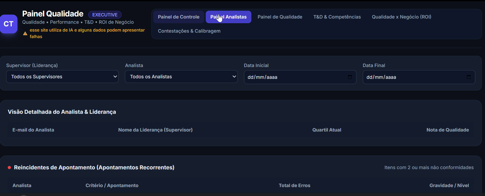

# Web App de Indicadores de Qualidade

> Aplicação Web (Single Page Application) desenvolvida em Google Apps Script para consolidar e exibir indicadores operacionais, permitindo que a liderança acompanhe as monitorias de qualidade em tempo real.

---

## Objetivo & Contexto de Negócio

* **Problema:** A liderança de vendas não possuía visibilidade imediata sobre os resultados das monitorias de qualidade. Os dados ficavam fragmentados em várias abas de planilhas complexas, dificultando a tomada de decisão rápida e o acompanhamento de desempenho da equipe.
* **Solução:** Desenvolvimento de um **Web App customizado** consumindo dados diretamente do Google Sheets. A aplicação funciona como um painel de controle (Dashboard) em tempo real, onde a liderança acessa um link único e visualiza todos os KPIs consolidados em uma interface web intuitiva e responsiva.

---

## Ferramentas

* **Backend / API:** [Google Apps Script](code.) (JavaScript)
* **Frontend:** HTML5, CSS3 e JavaScript Vanilla
* **Banco de Dados:** Google Sheets (Múltiplas abas relacionais: `general_data`, `checklist`, `ncg`, `feedback`, `contest`)
* **Padrão Arquitetural:** MVC (Model-View-Controller) / JSON Data Parsing

---

## Demonstração Visual



---

## ⚙️ Arquitetura do Fluxo

```text
[ Banco de Dados (Google Sheets) ]
  (Abas: aux, general, checklist...)
                 │
                 ▼
 [ Backend (Code.gs - Google Apps Script) ]
  • Mapeamento das planilhas
  • Tratamento e conversão de Datas
  • Empacotamento dos dados em JSON
                 │
                 ▼
 [ Frontend (Index.html via doGet) ]
  • Consumo do objeto JSON
  • Renderização Gráfica em Tempo Real
  • Visualização pela Liderança
